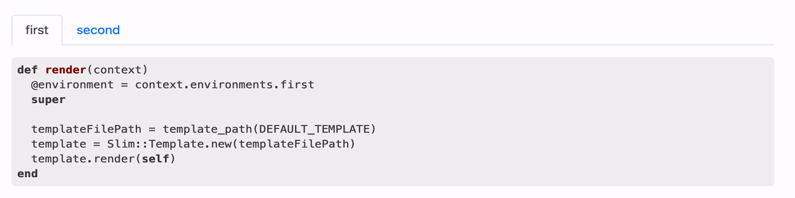

Jekyll Simple Tabs
[](https://badge.fury.io/rb/jekyll-simple-tab)
===========

This Jekyll plugin for adding tabs. It works with bootstrap 4

Installation
------------

Add this line to your Gemfile:

```ruby
group :jekyll_plugins do
  gem "jekyll-simple-tab"
end
```

Add in you _config.yml:

```yaml
plugins_dir:
  - jekyll-simple-tab
```

Plugin need bootstrap 4, add to html head tag:

```html
<link rel="stylesheet" href="https://maxcdn.bootstrapcdn.com/bootstrap/4.0.0/css/bootstrap.min.css" integrity="sha384-Gn5384xqQ1aoWXA+058RXPxPg6fy4IWvTNh0E263XmFcJlSAwiGgFAW/dAiS6JXm" crossorigin="anonymous">
<script src="https://maxcdn.bootstrapcdn.com/bootstrap/4.0.0/js/bootstrap.min.js" integrity="sha384-JZR6Spejh4U02d8jOt6vLEHfe/JQGiRRSQQxSfFWpi1MquVdAyjUar5+76PVCmYl" crossorigin="anonymous"></script>
```

Usage
-----

````



```ruby
def render(context)
  @environment = context.environments.first
  super

  templateFilePath = template_path(DEFAULT_TEMPLATE)
  template = Slim::Template.new(templateFilePath)
  template.render(self)
end
```



## Header

> Blockquotes




````


