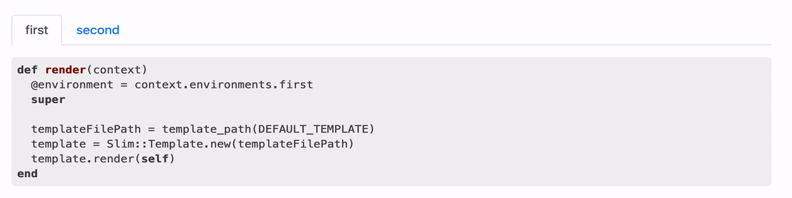

Jekyll Simple Tabs
===========

This Jekyll plugin for adding tabs. It works with bootstrap 4

Installation
------------

Add this line to your Gemfile:

```ruby
group :jekyll_plugins do
  
  gem "jekyll-simple-tab"
end
```

Add in you _config.yml:

```yaml
plugins_dev:
  - jekyll-simple-tab
```

Usage
-----

````



```ruby
def render(context)
  @environment = context.environments.first
  super

  templateFilePath = template_path(DEFAULT_TEMPLATE)
  template = Slim::Template.new(templateFilePath)
  template.render(self)
end
```



## Header

> Blockquotes




````


